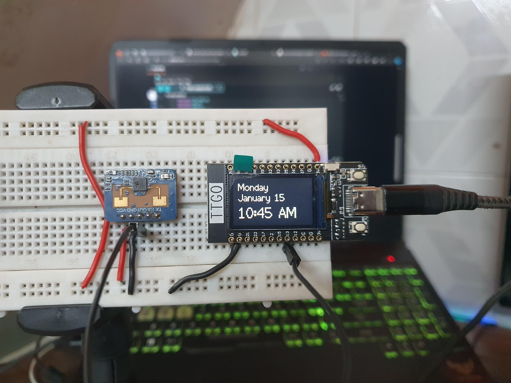

# ESP32 Motion Sensor Display Control
 I built a device that automatically turn on/off my OLED monitor screen with a motion sensor. I use this OLED screen as a computer monitor , so this helps protect the OLED againts burn in when i'm away from the display. 

 I have also implemented the same steps with my OLED TV too, to protect it from burn in

 This project is designed to automatically turn on/off an OLED monitor or TV screen using an ESP32 microcontroller and a motion sensor. The primary goal is to protect the OLED display from burn-in when the user is away from the display.
  
## Overview

The device uses the following components:
1. LilyGo TTGO T-Display ESP32 Microcontroller
2. LD2410C MMwave Motion Sensor
3. Python Flask Server (For controlling the OLED monitor connected to a Windows Machine)
4. Home Assistant Server (For controlling the OLED TV)

## Implementation

### LilyGo TTGO T-Display ESP32 Microcontroller
The ESP32 microcontroller is the heart of the system. It interfaces with the motion sensor and communicates with the servers to control the OLED displays.

### LD2410C MMwave Motion Sensor
The LD2410C MMwave motion sensor is used to detect human presence. The ESP32 reacts to motion events to determine when to turn on or off the OLED displays.

### Python Flask Server
A Python Flask server is implemented to send commands from the ESP32 to a Windows Machine. These commands are used to automatically sleep the OLED monitor based on human presence. The server utilizes NIRCMD software for this purpose.

### Home Assistant Server
The Home Assistant server is utilized to send commands to the OLED TV. This allows for control over the TV screen based on motion detection.

## Usage

### Requirements
- LilyGo TTGO T-Display ESP32 Microcontroller
- LD2410C MMwave Motion Sensor
- Python Flask Server (with NIRCMD installed)
- Home Assistant Server

### Installation
1. Set up the ESP32 microcontroller with the provided Arduino code.
2. Connect the LD2410C motion sensor to the ESP32.
3. Install and configure the Python Flask server on the Windows Machine.
4. Configure the Home Assistant server to communicate with the OLED TV.

### Configuration
Adjust the WiFi credentials, server URLs, and other parameters in the Arduino code to match your specific hardware and network configuration.

## Wiring
ESP32 | LD2410C  
5V <-> VCC  
GND <-> GND  
GPIO 13 (Configurable) <-> OUT  

### Contributing
Feel free to contribute to this project by submitting issues, proposing new features, or making improvements to the code..

### License
[GNU LICENSE](LICENSE)

Thank You
